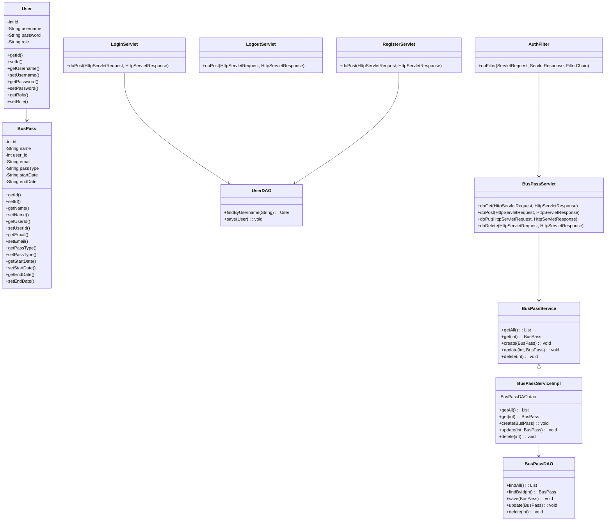

```mermaid
---
config:
  theme: default
---
classDiagram
class User {
  -int id
  -String username
  -String password
  -String role
  +getId()
  +setId()
  +getUsername()
  +setUsername()
  +getPassword()
  +setPassword()
  +getRole()
  +setRole()
}

class BusPass {
  -int id
  -String name
  -int user_id
  -String email
  -String passType
  -String startDate
  -String endDate
  +getId()
  +setId()
  +getName()
  +setName()
  +getUserId()
  +setUserId()
  +getEmail()
  +setEmail()
  +getPassType()
  +setPassType()
  +getStartDate()
  +setStartDate()
  +getEndDate()
  +setEndDate()
}
class UserDAO {
  +findByUsername(String): User
  +save(User): void
}

class BusPassDAO {
  +findAll(): List<BusPass>
  +findById(int): BusPass
  +save(BusPass): void
  +update(BusPass): void
  +delete(int): void
}
class BusPassService {
  +getAll(): List<BusPass>
  +get(int): BusPass
  +create(BusPass): void
  +update(int, BusPass): void
  +delete(int): void
}
class BusPassServiceImpl {
  -BusPassDAO dao
  +getAll(): List<BusPass>
  +get(int): BusPass
  +create(BusPass): void
  +update(int, BusPass): void
  +delete(int): void
}
class LoginServlet {
  +doPost(HttpServletRequest, HttpServletResponse)
}

class LogoutServlet {
  +doPost(HttpServletRequest, HttpServletResponse)
}

class RegisterServlet {
  +doPost(HttpServletRequest, HttpServletResponse)
}

class BusPassServlet {
  +doGet(HttpServletRequest, HttpServletResponse)
  +doPost(HttpServletRequest, HttpServletResponse)
  +doPut(HttpServletRequest, HttpServletResponse)
  +doDelete(HttpServletRequest, HttpServletResponse)
}
class AuthFilter {
  +doFilter(ServletRequest, ServletResponse, FilterChain)
}
User --> BusPass

BusPassService <|.. BusPassServiceImpl
BusPassServiceImpl --> BusPassDAO

BusPassServlet --> BusPassService
LoginServlet --> UserDAO
RegisterServlet --> UserDAO
AuthFilter --> BusPassServlet

```
