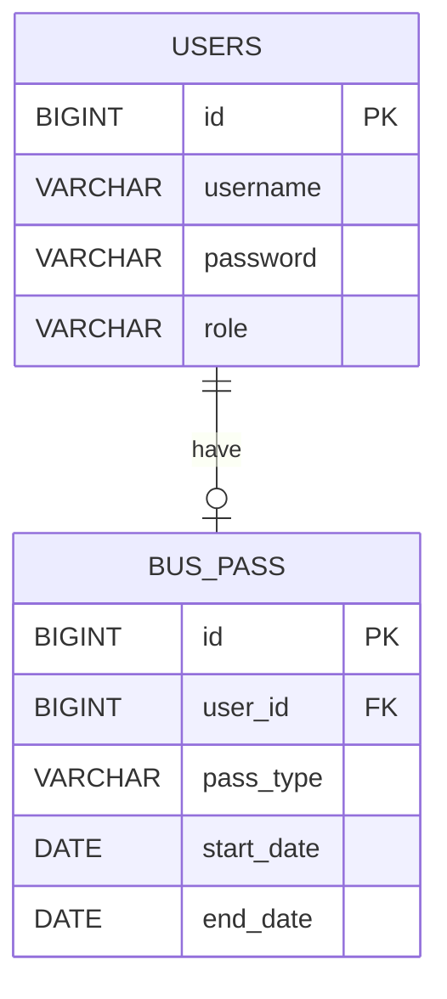

```mermaid
---
config:
  theme: default
---
erDiagram

    USERS {
        BIGINT id PK
        VARCHAR username
        VARCHAR password
        VARCHAR role
    }

    BUS_PASS {
        BIGINT id PK
        BIGINT user_id FK
        VARCHAR pass_type
        DATE start_date
        DATE end_date
    }

    USERS ||--o| BUS_PASS : "have"
```
